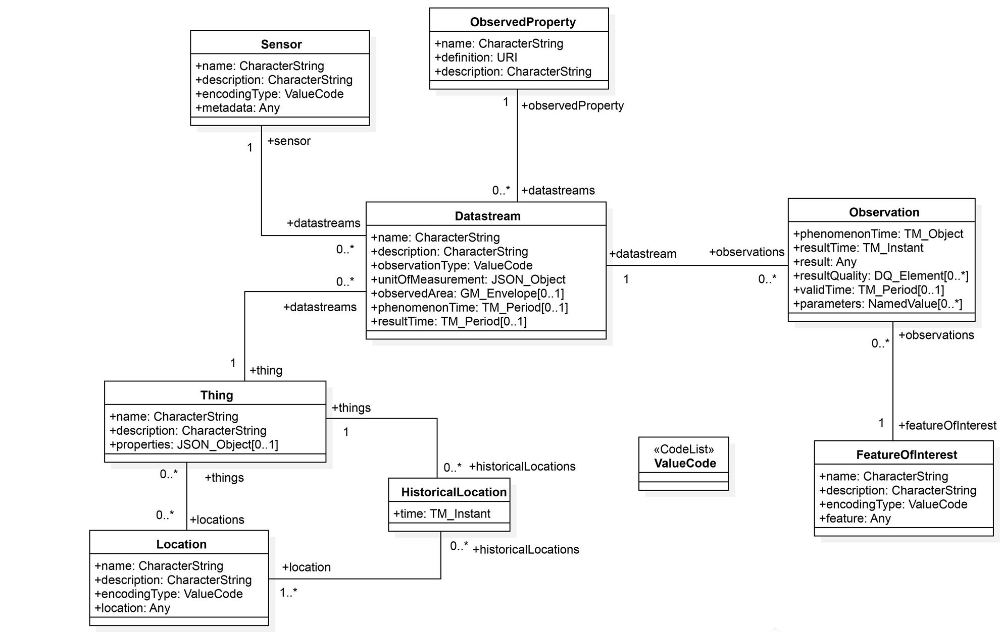

<style>
body {
text-align: justify}
</style>

## Introduction

The [OGC SensorThings API](http://developers.sensorup.com/docs/) is a web standard for wireless sensor networks (WSN) and aims to provide an interoperable, unified framework for handling sensor data. The standard is based on elements from [OGC Sensor Web Enablement (SWE)](http://www.opengeospatial.org/ogc/markets-technologies/swe), but is designed to provide interconnectivity between Internet of Things (IoT) devices, data and applications over the web. By implementing SensorThings into WSNs, developers don't have to worry about heterogeneity of devices, data formats and web protocols. Web development using standards facilitates easier data accessibility, higher interoperability, and eventually lowers the costs of sensor and gateway providers.


## Motivation

The motivation for creating an R implementation of the SensorThings API emerged from a project in the scope of the author's master thesis. The project includes making an IoT sensor network in an agricultural environment SensorThings compliant. Since R is one of the leading programming environments for statistics and data analysis, but also includes software development functionalities, the idea materialised to write a package that uses the SensorThingsAPI to import data from the web. After importing the data, they can be used for further analysis. Furthermore, an interactive data visualisation tool for displaying the sensor locations and the station details was created using the functions within the package.


## How it works

SensorThings API relies on a set of eight classes (see **Fig 1**) that are interrelated using web URLs. Starting at a base URL (e.g. [https://toronto-bike-snapshot.sensorup.com/v1.0](https://toronto-bike-snapshot.sensorup.com/v1.0)), API data can be accessed by adding parameters to it. sensorThings4R makes use of the concept by defining a set of functions that compile SensorThings URLs and various parameters, use these in a http request, parse the resulting JSON data and store them in R dataframes for further usage.

&nbsp;
&nbsp;

```{r pressure, echo=FALSE, fig.cap="**Fig 1:** SensorThings Data Model", out.width = '100%'}

```

&nbsp;
&nbsp;

## Installation

- Install with Git:
```{r, eval=FALSE}
devtools::install_github("danji90/sensorThings4R")
```
&nbsp;
&nbsp;

- Install manually with a .tar.gz file

&nbsp;
&nbsp;

## Functions

```{r, include=FALSE}
library(kableExtra)
```

To use the functions in sensorThings4R, first import the installed package:

```{r}
library(sensorThings4R)
```

#### Import JSON data into dataframe

Functions that request the data using the SensorThings base url, then parse and store the loaded JSON data in a dataframe. Depending on the function, the new dataframes are assigned the classes "locationObject", "foiObject" or "thingObject".

```{r}
# Load SensorThings Locations
loc = senseLocations("https://toronto-bike-snapshot.sensorup.com/v1.0")
class(loc)


# Load SensorThings FoIs
foi = senseFoI("https://toronto-bike-snapshot.sensorup.com/v1.0")
class(foi)


# Load SensorThings Things
s1 = senseThings("https://toronto-bike-snapshot.sensorup.com/v1.0")

class(s1)
```

&nbsp;
&nbsp;
&nbsp;


#### Processing for map visualisation

These functions convert "locationObject" and "foiObject" dataframes into new dataframes capable of being loaded to a leaflet map. The output dataframes have the added class "mapThing".

```{r}
level1 = senseLocations("http://example.sensorup.com/v1.0")
level2 = makeThingLocation(level1)

knitr::kable(level2) %>%
  kable_styling(bootstrap_options = "striped", font_size = 10) %>%
  scroll_box(width = "100%", height = "200px")

class(level2)

n = senseFoI("http://example.sensorup.com/v1.0")
u = makeThingFoI(n)

knitr::kable(tail(u)) %>%
  kable_styling(bootstrap_options = "striped", font_size = 10) %>%
  scroll_box(width = "100%", height = "200px")
```

&nbsp;
&nbsp;
&nbsp;

#### Mapping functions

The mapping functions load "mapThing" dataframes onto a leaflet map.

```{r, out.width='100%'}
x = senseLocations("http://example.sensorup.com/v1.0")
y = makeThingLocation(x)
mapThingLocations(y)

j = senseFoI("https://toronto-bike-snapshot.sensorup.com/v1.0")
k = makeThingFoI(j)
mapThingFoI(k)
```

&nbsp;
&nbsp;
&nbsp;

The methods only accept objects of the classes they are designed for. An error message will indicate that the object does not have the right classes and can't be mapped.

```{r,error=TRUE}
mapThingFoI(j)
class(j)
```


&nbsp;
&nbsp;
&nbsp;

Express map functions combine the importing, processing and mapping functions to instantly create a map using an input SensorThings base url.

&nbsp;
&nbsp;
&nbsp;

```{r, out.width='100%'}
leaf1 = expressMapFoI("https://tasking-test.sensorup.com/v1.0")
leaf1
```

&nbsp;
&nbsp;
&nbsp;

#### ShinyThings

This function launches ShinyThings when called, a [Shiny application](https://shiny.rstudio.com) to display the locations in a sensor network and the station details. The UI provides simple user interaction with the app.

```{r, eval=FALSE}
shinyThings()
```

&nbsp;
&nbsp;
&nbsp;


## Challenges

The main aim of the package was to access SensorThings data and visualise them in R interactively. The first task was displaying the stations on a map, which worked pretty smoothly. The second task was to display data from the API.

The second task proved to be a very tricky affair, since the information needed to plot the data is not all stored in one JSON file, but rather in multiple ones. 

To give an example:
For a FeatureOfInterest with ID = 1586 I want to plot all the observations of a certain observed property. FeatureOfInterest and Observations have a direct relation in the SensorThings schema, meaning [https://toronto-bike-snapshot.sensorup.com/v1.0/FeaturesOfInterest(1586)/Observations](https://toronto-bike-snapshot.sensorup.com/v1.0/FeaturesOfInterest(1586)/Observations) will request all the observations measured at the FeatureOfInterest(1586). But the requested JSON file does not include information about the measured observed property, so plotting these observations might include different measured parameters. To inquire about  observations' observed property, for each observation two API requests have to be called, navigating to the ObservedProperty class. Consequently, a set of 100 observations requires 200 http requests to classify each observation's observed property. 

An approach was made to loop over the rows of a dataframe containing 100 observations, extracting the necessary plotting data and storing it in a dataframe. Results were poor regarding performance, taking over 10 minutes to gather all the necessary information. This test was made using WWU Campus WIFI, which has a sound bandwidth. Performance would be considerably worse in slower internet connections. Furthermore, larger amounts of data would increase computing time even further. A better developed code may enhance performance, which was not possible in this project considering the limited time frame.


&nbsp;
&nbsp;
&nbsp;

## Conclusions & Future Work

The results of sensorThings4R are mostly satisfactory, especially considering the provided project time frame. The package contains functions to successfully import SensorThings geographical data into R directly from the web. The SensorThings web standard ensures that generic functions provide standarised results using any SensorThings API base URL. The shiny app ShinyThings uses the functions from the package as an example of how the API can be used for displaying data in an interactive and responsive way.

However, a somewhat disappointing result was the unfeasibility of plotting observations from the SensorThings API. This would be the most interesting and most useful feature to implement. It was concluded that R has difficulties handling large amounts of http requests with the attempted approach to plot larger amounts of data. A possible reason could be that R is not designed for web development. 

Future work could include accessing the SensorThings API data from different angles. The packages for sensor data [sos4R](https://github.com/52North/sos4R) and [opensensemapR](https://github.com/noerw/opensensmapR) may suggest better solutions for accessing data in the web. Another approach might be outsourcing the http requests (e.g. using a web browser) and then importing them into R. 

&nbsp;
&nbsp;
&nbsp;

## References

- [SensorUp Developers Centre](http://developers.sensorup.com/docs/)
- [OGC SensorThings API - Documentation](http://docs.opengeospatial.org/is/15-078r6/15-078r6.html)
- [OGC SensorThings - GitHub](https://github.com/opengeospatial/sensorthings)


